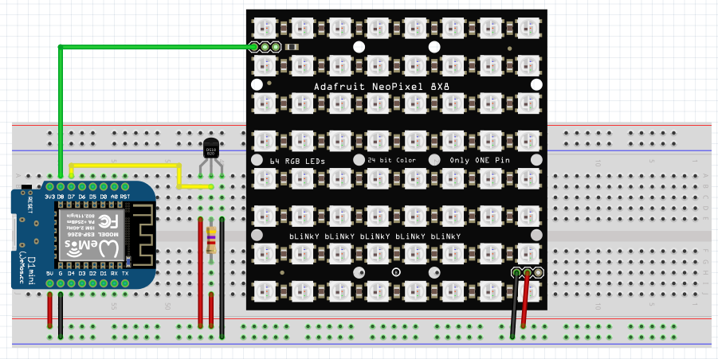

# WiFi Neopixel
*Simple project to display some information coming from Internet on a NeoPixel 8x8 matrix*

This project uses a **8x8 NeoPixel** matrix as display to show indoor and outdoor temperature, the current time and current date. Datetime data and outdoor weather informations are retrieved from Internet so, to build this project i choose the **Mini D1** board based on **ESP8266** microcontroller.

The software consumes the api of [worldtimeapi.org](http://worldtimeapi.org) to fetch date and time.
The outdoor weather infomation are retrieved from [openweathermap.org](https://openweathermap.org/).
Instead, to measure the indoor temperature, it uses the 1-wire temperature sendor **DS81B20**.

To compile the software and flash the board you can use [Adruino IDE](https://www.arduino.cc/en/software).

## List of componets
- [AZDelivery 3 x D1 Mini (Amazon)](https://www.amazon.it/AZDelivery-D1-ESP8266-12E-gratuito-compatibile/dp/B0754N794H/ref=sr_1_1?__mk_it_IT=%C3%85M%C3%85%C5%BD%C3%95%C3%91&crid=27DHMZWHB6MMD&keywords=mini+d1&qid=1658864759&sprefix=mini+d1%2Caps%2C230&sr=8-1)
- [WS2812B based RGB Led 8x8 Matrix (Amazon)](https://www.amazon.it/dp/B088W62171?pd_rd_i=B088K1JH6X&pf_rd_p=a38a5fa1-c9a9-4345-a3da-a6bbe0978c49&pf_rd_r=0W3DP4ZETME1TG6JK92P&pd_rd_wg=83YAi&pd_rd_w=PcCFq&pd_rd_r=73ecdc62-dfac-45e3-aae3-c8a7fb57ec47&th=1)
- [DS18B20 1-wire termometer (Amazon)](https://www.amazon.it/DS18B20-termometro-digitale-Dallas-ds1820/dp/B00AYE2T2O/ref=sr_1_12?keywords=dallas+18b20&qid=1658864978&sprefix=dallas+%2Caps%2C148&sr=8-12)
- [4.7KΩ Resistor - ¼ Watt (Amazon)](https://www.amazon.it/ARCELI-Resistenza-Pacchetto-resistore-precisione/dp/B07PXYY4HV/ref=sr_1_14?keywords=resistenza+4.7k&qid=1658865323&sprefix=resistenze+4.7%2Caps%2C134&sr=8-14)

## Configuring Arduino IDE
As default Adruino IDE doesn't support the Mini D1 board. Before star codeing for this board you need to configure the IDE poperly.

### Configuration steps
1. Open your Arduino IDE and in `File > Settings` add the following lines inside `Additional Boards Manager URLs`:
    ```
    https://dl.espressif.com/dl/package_esp32_index.json
    http://arduino.esp8266.com/stable/package_esp8266com_index.json
    ```
2. Open the Boar Manager from `Tools > Board > Board Manager...`.
3. Search for `esp8266` and install it.
4. Now the Mini D1 board should be available inside `Tools > Board > ESP8266 Boards` list. Select it.

### Libraries
Here a list of all additional libraries used in this project. All the following libraries are available in the Arduino Library Manager:
- Adafruit NeoMatrix
- Adafruit NeoPixel
- Adafruit GFX
- ESP8266WiFi
- Arduino_JSON
- OneWire
- DallasTemperature

## How To Connect All Components


Power supply is provided by the micro-usb cable directly connected to the Mini D1 board.

## Configuring The Firmware
